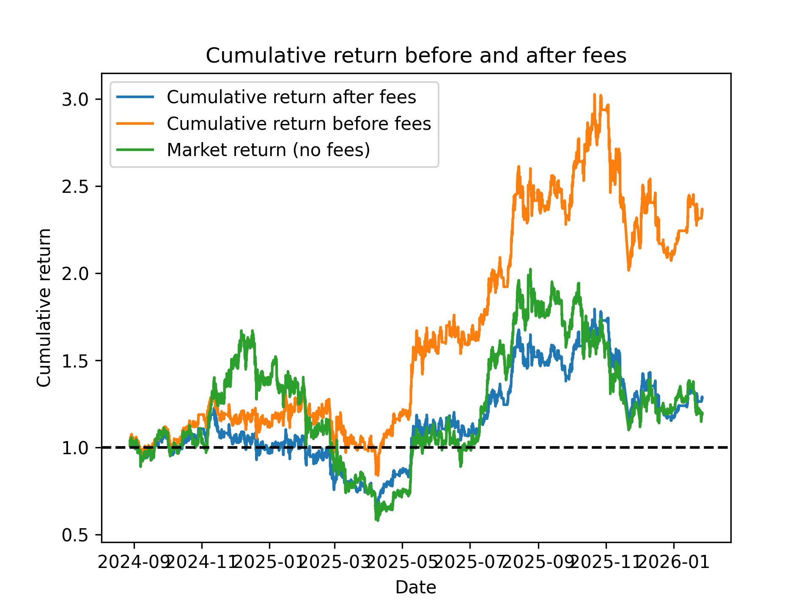
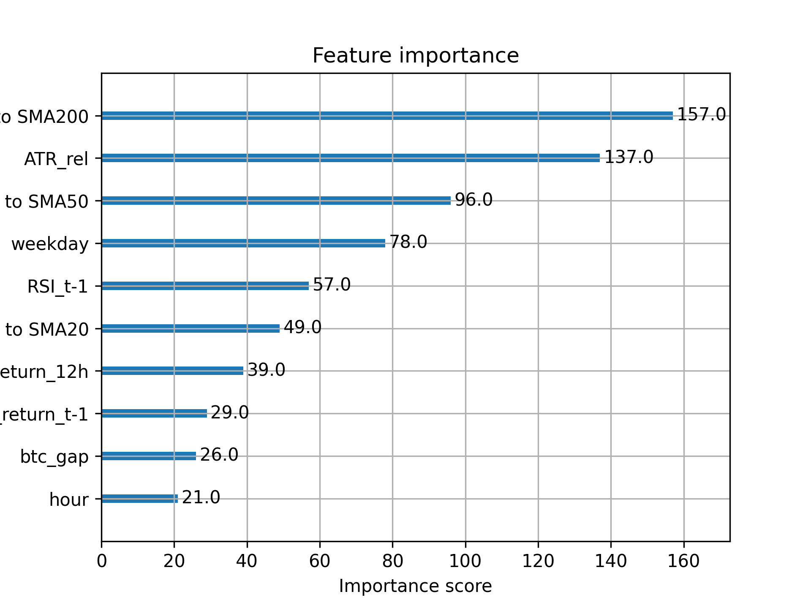

# Ethereum Algorithmic Trading: XGBoost Strategy with Transaction Costs

This project implements a short-term prediction model for Ethereum (ETH-USD) using the **XGBoost** classification algorithm. The main goal was to build a robust trading algorithm capable of performing in real market conditions, accounting for transaction fees, slippage, and regime changes.

## Target & strategy definition

The model is trained on an hourly dataset of the last 730 days and predicts whether it is an optimal time to enter a long position.

* **Labeling:** A binary target variable was engineered using a forward-looking return calculation. It equals 1 if the future return (in a 48h time window) reaches a specific threshold (e.g., >=4%) and 0 otherwise.

* **Methodology:** Model was defined using max_depth of 3 to avoid overfitting to noise in hourly ETH data. The model was evaluated using two training regimes: a static Full Training Set to establish a baseline and an Expanding Window (Walk-forward) to simulate a real production environment and adapt to the fast-paced crypto market.

* **Execution:** Once a signal is triggered, the strategy manages the position using a triple-barrier exit logic: Take-Profit, Stop-Loss, or Time-Horizon expiration—whichever occurs first.

## 📈 Performance & Risk mitigation

* **Gross vs. Net Cumulative returns:** The "Before fees" line shows a theoretical return exceeding 140%. However, by implementing a realistic **0.15% fee per trade** (accounting for slippage), the "After fees" line reveals the actual net profitability. The strategy achieved a net return of approximately **+30%** after all costs (Sept 2024 – Jan 2026), effectively tracking the overall market return for the period.

* **Risk Mitigation:** The model’s value is most evident during market corrections, where it has proven to minize losses and stabilize return path when compared to the market return. This was achieved through:

    1. **Probability Thresholding:** Only entries with a confidence score of **P > 0.60** were executed.
    2. **Stable Position Logic:** A custom function that prevents "churning" (over-trading) and enforces exit rules based on stop-loss and take-profit targets.

## 🛠️ Feature Engineering & Logic
The model's predictive power is derived from a mix of momentum, volatility, and cross-asset correlation features.

* **Distance to SMA200/50:** Identified as the most significant features, indicating a reliance on mean-reversion signals.
* **ATR_rel (Volatility):** Helps the model adjust risk thresholds based on current market noise.
* **BTC Gap:** While Bitcoin is often a leading indicator, its relative impact on hourly Ethereum data is less consequential, likely because arbitrage between the two assets occurs on even lower timeframes, while fundamental shifts of capital happen on longer scale (daily).

## 🚀 Future work to be done
* **Flexible probability thresholding:** Due to the conservative buy threshold, the model sometimes misses out on bull periods. Instead of a fixed P > 0.60, a dynamic threshold could be implemented. In a strong uptrend (e.g., price > SMA200), lower the threshold to catch more momentum. In a downtrend, keep it at 0.60 or higher to remain defensive.
* **Addition of new explanatory variables:** Add more variables to better identify bull and bear runs, such as volume profiles or ETH funding rates.

## Caution
While the backtest includes a 0.15% fee, real-world execution involves variable slippage and potentially network gas fees that can impact net profitability on lower timeframes.